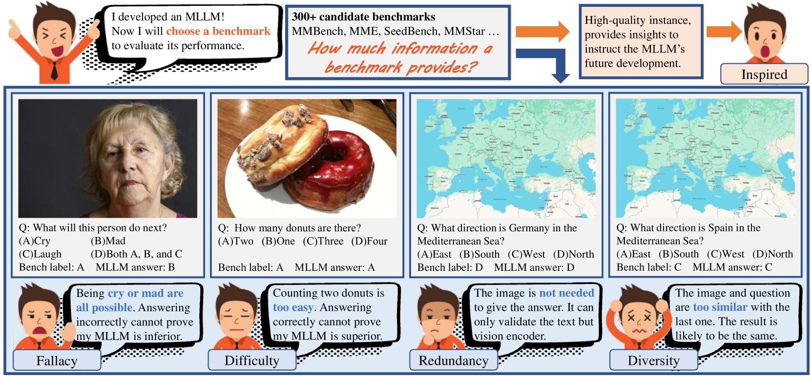

    

 

  
  
  
  
 

 <!--  

      
 
 -->

 <h1>Information Density Principle for MLLM Benchmarks</h1>

 _How much insight a benchmark can provide for the development of MLLMs?_

 

      <a href="https://lcysyzxdxc.github.io" target="_blank">Chunyi Li</a>1,2,
      <a href="https://openreview.net/profile?id=~Xiaozhe_Li2" target="_blank">Xiaozhe Li</a>2,3,
      <a href="https://zzc-1998.github.io/" target="_blank">Zicheng Zhang</a>1,2,
      <a href="https://scholar.google.com/citations?hl=en&user=Kzd0qtsAAAAJ" target="_blank">Yuan Tian</a>1,2,
      <a href="https://scholar.google.com/citations?user=JYqad5sAAAAJ&hl=en" target="_blank">Ziheng Jia</a>1,
 

 

      <a href="https://jhc.sjtu.edu.cn/~xiaohongliu/" target="_blank">Xiaohong Liu</a>1,
      <a href="https://minxiongkuo.github.io/" target="_blank">Xiongkuo Min</a>1,
      <a href="https://kennymckormick.github.io/" target="_blank">Haodong Duan</a>2,
      <a href="https://chenkai.site/" target="_blank">Kai Chen</a>2,   
      <a href="https://ee.sjtu.edu.cn/EN/FacultyDetail.aspx?id=25&infoid=153&flag=153" target="_blank">Jia Wang</a>1,
      <a href="https://ee.sjtu.edu.cn/en/FacultyDetail.aspx?id=24&infoid=153&flag=153" target="_blank">Guangtao Zhai</a>1,2
 

 

  1Shanghai Jiaotong University,  2Shanghai AI Lab, 3Tongji University
 
 
<!--  

  *Corresponding author. 
 
 -->
 <a href="https://arxiv.org/pdf/2503.10079"><strong>Paper</strong></a> |
 <a href="https://github.com/lcysyzxdxc/bench4bench"><strong>Project Page</strong></a> |
 <a href="https://huggingface.co/datasets/lcysyzxdxc/bench4bench"><strong>Data</strong></a> 
 

      
 

With the emergence of Multimodal Large Language Models (MLLMs), hundreds of benchmarks have been developed to ensure the reliability of MLLMs in downstream tasks. However, the evaluation mechanism itself may not be reliable. For MLLM developers, a benchmark serves the MLLM, and a good benchmark should provide as many insights as possible, revealing where the model needs improvement. Therefore, we define the quality of this service as Information Density: the volume of meaningful information reflected by a certain number of samples. There are four attributes that lead to defects in information density:

- **Fallacy**: A sample is poorly formulated, where the information reflected is not reliable.
- **Difficulty**: A sample is too simple thus almost all MLLMs are correct, giving no meaningful information.
- **Redundancy**: A sample that can be answered correctly based on only part of the information, with the remaining part being redundant.
- **Diversity**: Multiple samples that are too similar, resulting in overlapping information reflected in the responses.

## ⏰ Release
- [2024/6/13] 🔥 [Github repo](https://github.com/lcysyzxdxc/bench4bench) for **Imfomation Density** is online.
- [To Do] [ ] Update the **Human Eval** annotation principle.
- [To Do] [ ] Update the **Model Eval** code. 
- [To Do] [ ] Update the **Data Eval** code. 

## 🌟 Leaderboard of Infomation Density
Benchmarks that apply the information density principle have the following three conditions:
- Multi-modal: Each sample must contain only one image and one paragraph of text.
- Multi-choices: The correct answer is within the range of choices, rather than open-ended questions.
- Multi-task: The dataset is oriented towards general tasks, rather than specialized tasks such as mathematics/physics. (see our paper)

Additionally, this work **does not involve praising or criticizing** any multimodal benchmarks, nor is it a commercial leaderboard for ranking. Among the four dimensions, only the Fallacy score has an objective measure of quality (where lower values are preferable). The other three dimensions are used to represent the amount of information, instead of inherently superior or inferior values, whose appropriateness depends on the specific evaluation context.

  
| Benchmark       | Fallacy↓    | Difficulty↑ | Redundancy↓ | Diversity↑  | Time     |
|-----------------|-------------|-------------|-------------|-------------|----------|
| A-okvqa         | 0.597       | 0.157       | 0.243       | 0.882       | Jun-2022 |
| POPE            | 0.557       | 0.119       | 0.562       | 0.383       | May-2023 |
| MME             | 0.526       | 0.206       | 0.133       | 0.842       | Jun-2023 |
| MMBench-v1.0    | 0.578       | 0.157       | 0.149       | 0.861       | Jul-2023 |
| SEEDBench       | 0.333       | 0.320       | 0.155       | 0.796       | Jul-2023 |
| Q-Bench         | 0.280       | 0.373       | 0.175       | **0.951**   | Sep-2023 |
| HallusionBench  | 0.269       | 0.465       | 0.312       | 0.191       | Oct-2023 |
| SEEDBench2      | 0.392       | 0.325       | 0.136       | 0.365       | Nov-2023 |
| MMStar          | **0.135**   | **0.546**   | **0.054**   | 0.827       | Mar-2024 |
| MMBench-v1.1    | 0.306       | 0.172       | 0.076       | 0.865       | Apr-2024 |
| RealWorldQA     | 0.247       | 0.379       | 0.113       | 0.756       | Apr-2024 |
| SEEDBench2+     | 0.646       | 0.397       | 0.252       | 0.818       | Apr-2024 |
| MMMB            | 0.239       | 0.237       | 0.216       | 0.812       | Jun-2024 |
| A-Bench         | 0.333       | 0.398       | 0.214       | **0.941**   | Jun-2024 |
| TaskMeAnything  | **0.206**   | 0.392       | 0.085       | 0.850       | Jun-2024 |
| MME-Realworld   | 0.480       | **0.666**   | **0.040**   | 0.701       | Aug-2024 |
| HR-Bench        | 0.369       | 0.380       | 0.113       | 0.205       | Aug-2024 |
| R-Bench         | 0.336       | 0.382       | 0.110       | 0.873       | Sep-2024 |
<!-- | NaturalBench    | 0.464       | 0.215       | 0.209       | 0.478       | Oct-2024 | -->

## ✉️ Contact

Please contact the first author of this paper for queries.

- Chunyi Li, `lcysyzxdxc@sjtu.edu.cn`, @lcysyzxdxc

